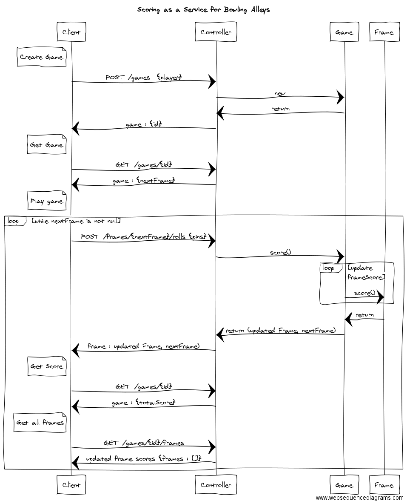

# Scoring Model

---

# Algorithm

- Simple object-oriented - rich domain model
- Handles placement of rolls in frames
- Handles scoring all frames, as you go, on each roll event

---

# Rest - Original

    POST /game  {"player" : "levi"} -> { "id" : 1 }
    POST /game/{id}/roll  {"pins" : 5}  -> { ... game ... }  (rpc-ish)

---

# Rest - V2 - Finer Grained 

note:  HAL/HATEOS oriented

    POST /players                  {"name" : "levi"}       -> {href}
    POST /games                    {"player" : {href} }    -> {... id ...}
    GET  /games/{id}               {"player" : {href} }    -> {... totalScore, nextFrame ...}
    POST /frames/{nextFrame}/roll  {"pins" : 5}            -> {... frameScore, nextFrame ...}
    GET  /games/{id}/frames                                -> {... "_embedded" : frames : [] ...}

    PUT  /frames/{id}               { rolls : []}          -> {... frameScore, nextFrame ...}
    
---

# Sequence Diagram - V2

---

# Systems Architecture

